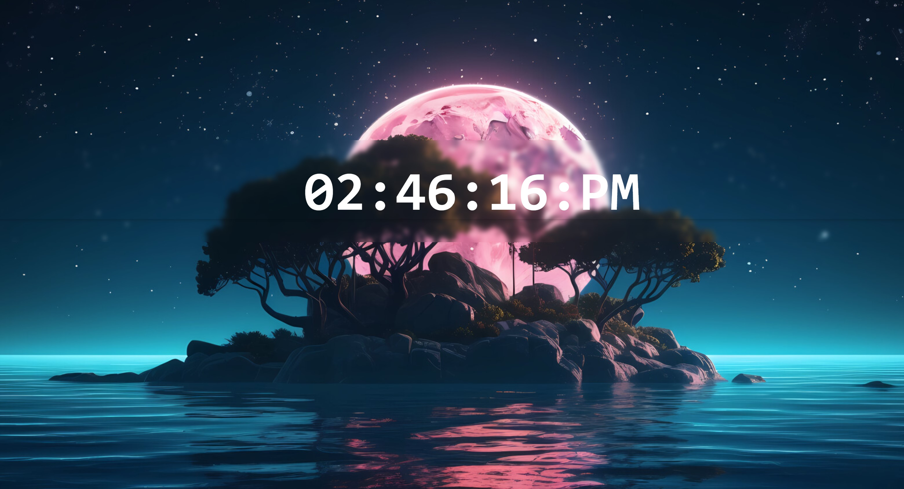

# Digital Clock

A modern and stylish digital clock web application that displays the current time and features an amazing, customizable theme. Built using React.js and Vite for fast and efficient development.

## Features

- **Real-Time Clock**: Displays the current time, updated every second.
- **Dynamic Theme**: Includes an amazing theme with options for customization.
- **Responsive Design**: Works seamlessly across devices (desktop, tablet, and mobile).
- **Lightweight & Fast**: Built with Vite for optimized performance.

## Preview



## Technologies Used

- **React.js**: For building the user interface.
- **Vite**: As the build tool for a faster development experience.
- **CSS/Tailwind CSS**: For styling the application and managing the theme.

## Getting Started

Follow these instructions to get a copy of the project up and running on your local machine.

### Prerequisites

Make sure you have the following installed on your system:
- [Node.js](https://nodejs.org/) (version 14 or higher)
- [npm](https://www.npmjs.com/) or [yarn](https://yarnpkg.com/)

### Installation

1. Clone the repository:
   ```bash
  git clone https://github.com/davisrya/DigitalClock.git
   cd digital-clock

2. Install dependencies:
    npm install
    # or
    yarn install

3. Open your browser and visit:
    http://localhost:5173

 Build for Production   
    npm run build
    # or
    yarn build

Customization
    .To customize the theme, update the CSS variables or modify the Tailwind configuration file.
    .You can add more features such as a 12/24-hour toggle, date display, or additional themes.   

Contributing
    Contributions are welcome! If you'd like to improve the project, follow these steps:

1. Fork the repository.
2. Create a new branch:
    git checkout -b feature/your-feature-name
3. Commit your changes:
    git commit -m "Add your feature description"

4. Push to the branch:
    git push origin feature/your-feature-name
5. Open a pull request.

License
This project is licensed under the MIT License.

Acknowledgements
Special thanks to the React.js and Vite communities for their amazing tools.
Icons by [Source/Website] (if any).
Contact
If you have any questions or suggestions, feel free to contact me at:

Email: kijabryan@gmail.com
GitHub: davisrya(Ryan)
